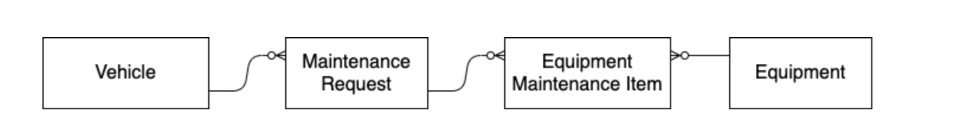

# Apex Specialist Superbadge

This superbadge demonstated my ability with Apex classes and Triggers.

## Object Relationships

## Automation with Apex Trigger
* When a Case record gets updated with the status being 'closed' and the type being 'Routine Maintenance' or 'Repair', a new case gets inserted with the Vehicle Custom Object, and the Equipment (Product) Standard Object tied to the new case via Lookup Relationship. Equipment Maintenance Items also get inserted with attachted new Case via a custom field called 'Maintenance Request'. The Trigger also handles bulkification to avoid governor Limits.

## Synchronise Warehouse Inventory and Scheduling
* I implemented a Queueable that performs an HTTP Callout to upsert new Equipment Records and it gets called by a Scheduleable Class that runs daily at 1 AM during Off Work Hours

## Test Classes
* Each Class I implemented is fully tested and has Asserts that checks for each outcome.
